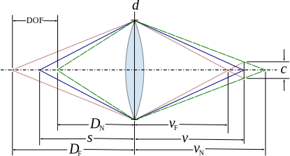
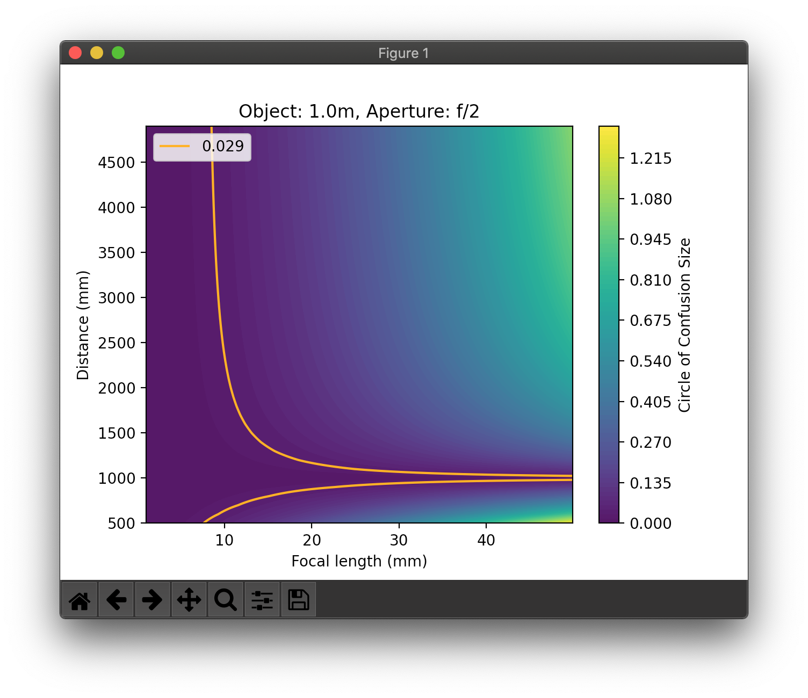
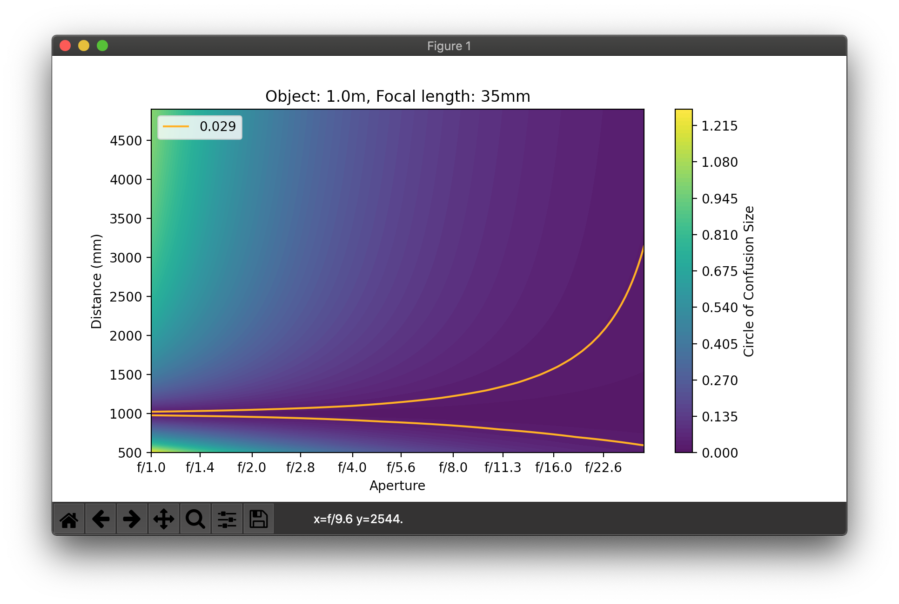
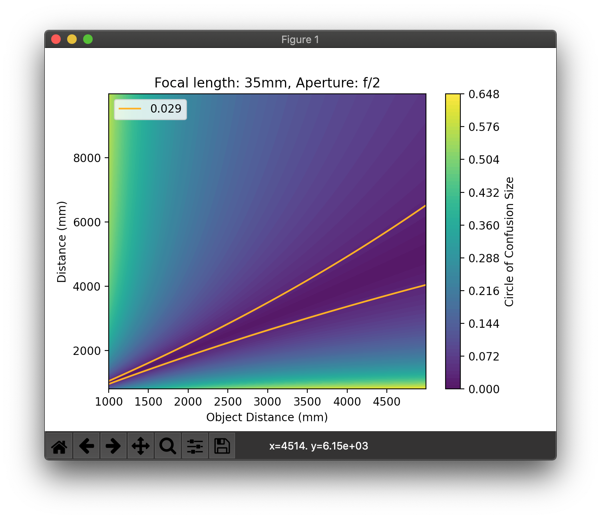
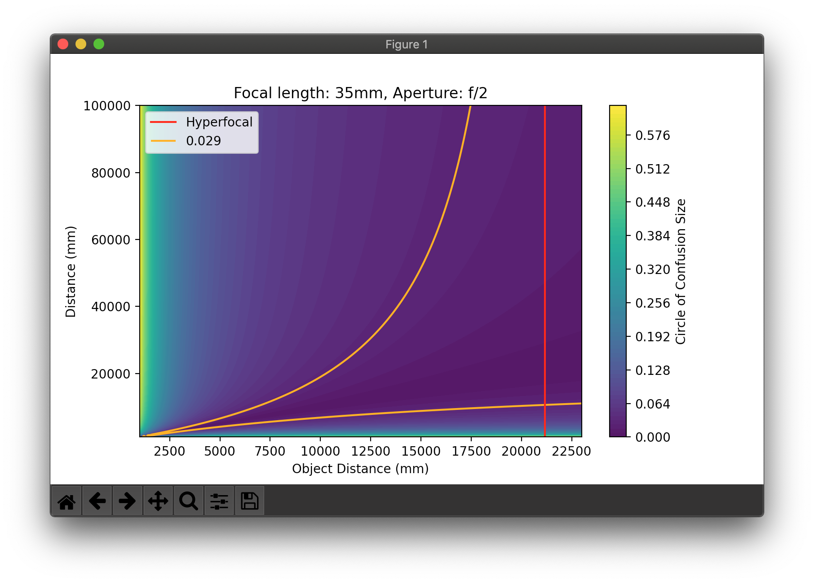
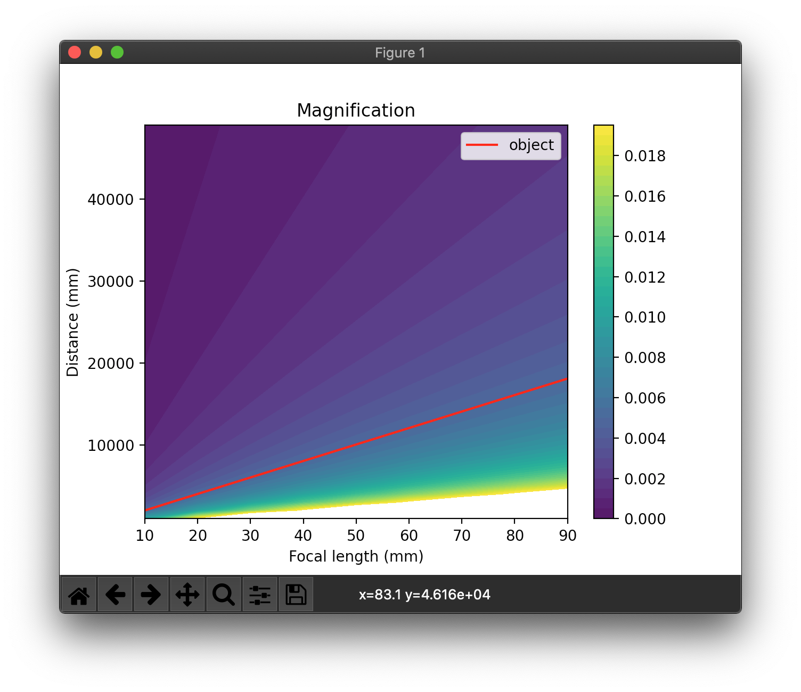

# 相機成像原理

## 理論模型

[影像來源](https://commons.wikimedia.org/wiki/File:DoF-sym.svg)

|       | 描述 | 解釋 |
| :---: | --- | --- |
|  $c$  | 模糊範圍 | 點光源在底片上成像的大小 |
|  $f$  | 焦距 | 鏡頭參數 |
|  $N$  | 焦比 | 鏡頭參數 |
|  $d$  | 光圈大小 | $f/N$, 鏡頭參數 |
|  $s$  | 主體（對焦點）距離 | 鏡頭參數 |
|  $v$  | 像距 | 鏡頭與底片距離, 由 $s, f$ 決定 |
|  $m$  | 放大率 | $v/s$ |
| $D_F$ | 景深遠點 | 物體能夠清晰成像的最遠距離 |
| $D_N$ | 景深近點 | 物體能夠清晰成像的最近距離 |
|  DOF  | 景深 | 物體能夠清晰成像的距離範圍 |
|  CoC  | 模糊圈 | 感光元件中人眼能分辨的最小距離 |

## 透鏡成像公式

$$
\frac{1}{v}+\frac{1}{s} = \frac{1}{f}
$$

放大率 $m$

$$
m = \frac{v}{s} = \frac{f}{s-f} = \frac{v-f}{f}
$$

可以用兩種不同的方法推導景深公式

## 景深公式

### 方法一 （同 Wikipedia）

用透鏡成像公式硬解

$$
\begin{align}
\frac{1}{f} &= \frac{1}{s}+\frac{1}{v} \\
\frac{1}{f} &= \frac{1}{D_F}+\frac{1}{\frac{f/N}{f/N + c}\cdot v} \\
\frac{1}{f} &= \frac{1}{D_N}+\frac{1}{\frac{f/N}{f/N - c}\cdot v} \\
\end{align}
$$

整理可得

$$
\begin{align}
D_F &= \frac{sf^2}{f^2+cNf-cNs} \\
D_N &= \frac{sf^2}{f^2-cNf+cNs} \\
\end{align}
$$

$$
\begin{align*}
c = \frac{f}{s-f}\cdot\frac{f}{N}\cdot\frac{D_f-s}{D_f} \\
  = \frac{f}{s-f}\cdot\frac{f}{N}\cdot\frac{s-D_n}{D_n} \\
  = \frac{f}{s-f}\cdot\frac{f}{N}\cdot\frac{|s-D|}{D} \\
\end{align*}
$$

### 方法二

計算模糊範圍 $c$ 在物體側相對應的大小 $x$, $m$ 為物體放大率

$$
\begin{align}
c &= mx \\
m &= \frac{v}{s} = \frac{f}{s-f} \\
x &= \frac{D_F-s}{D_F}d = \frac{s-D_N}{D_N}d = \frac{|s-D|}{D}d \\
\end{align}
$$

由此可得

$$
c = \frac{f}{s-f} \cdot \frac{f}{N} \cdot \frac{|s-D|}{D} \\
$$

## 景深

- 特定物體的模糊程度 $c$ 取決於焦距、光圈、主體（對焦點）、物體距離 ($f,  N, s, D$ ) 四個參數，並與光圈大小 ($f/N$) 成正比

- 當模糊程度 $c \le$ CoC，相對應的範圍 $D$ 即為景深 

  一個較小的景深可以由

  - 焦距變大
  - 光圈變大
  - 主體變近

## 模糊程度做圖

### 改變焦距

顏色越黃代表影像越模糊，橘線範圍內為景深。

### 改變光圈大小

顏色越黃代表影像越模糊，橘線範圍內為景深。

### 改變主體（對焦點）位置

顏色越黃代表影像越模糊，橘線範圍內為景深。

## 超焦距

當對焦在 $s = H$ 時，$D_F \to \infty$， $H$ 稱為超焦距

$$
D_f \to \infty, f^2+cNf-cNs = 0
$$

$$
H = f + \frac{f^2}{Nc}  \\
$$

$$
\begin{align}
D_f &\to \infty \\
D_n &= H/2 \\
\end{align}
$$

紅線為超焦距，可以看出 $D_F$ 會隨著 $s$ 接近 $H$ 而趨近無限大

顏色越黃代表影像越模糊，橘線範圍內為景深。

## 長焦壓縮

在主體大小不變的情況下（放大率$m$ 固定），用長焦鏡頭會使遠方物體放大率增加，造成距離壓縮的效果。

為了使主體大小不變，切換長焦鏡頭必須離主體越來越遠。

下圖紅線為主體位置。可以看出在相同距離下，使用長焦鏡的物體放大率會更大。

## Links

- [source code](src/dslr.py)
- [Wiki](https://zh.wikipedia.org/zh-tw/景深)
