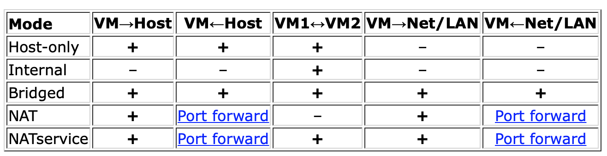

# Virtual Box

## Networking

-   When you want to create a vm in your host, choose NAT + Host-only network. NAT network for accessing the internet, Host-only network for accessing from your host.

-   When you want to create a vm on your lan, choose bridged network.



[Reference Page](https://www.virtualbox.org/manual/ch06.html)


## Vboxmanage Usage

### List VMs

```shell
vboxmanage list vms
vboxmanage list runningvms

```

### Control VMs


```shell
vboxmanage startvm <vm> [gui|headless]                    # default: gui
vboxmanage controlvm <vm> <acpipowerbutton|poweroff>      # recommend: acpipowerbutton

```

[Reference Page](https://www.virtualbox.org/manual/ch08.html)

